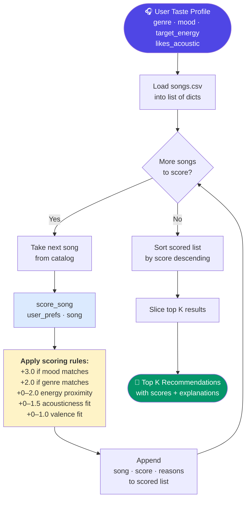

# 🎵 Music Recommender Simulation

## Project Summary

In this project you will build and explain a small music recommender system.

Your goal is to:

- Represent songs and a user "taste profile" as data
- Design a scoring rule that turns that data into recommendations
- Evaluate what your system gets right and wrong
- Reflect on how this mirrors real world AI recommenders

This simulation builds a content-based music recommender that scores songs against a user's declared taste profile. It prioritizes emotional fit (mood and energy) over stylistic labels (genre), reflecting the insight that a user wanting something "chill" is better served by a calm ambient track than a chill-labeled song with high energy. The system scores each song individually, ranks all scores, and returns the top matches with plain-language explanations of why each song was recommended.

---

## How The System Works

Real-world recommenders like Spotify and YouTube use two main strategies: collaborative filtering (learning from what millions of other users listen to) and content-based filtering (matching songs to a user based on the song's own attributes like tempo, energy, and mood). This simulation focuses on content-based filtering — it scores every song in the catalog against a user's declared preferences and surfaces the closest matches. Rather than learning from other users, it prioritizes the emotional and sonic qualities that describe what the user wants right now: their preferred mood, energy level, and whether they lean acoustic or electronic.

### `Song` features used in scoring

| Feature | Type | Role in scoring |
|---|---|---|
| `mood` | `str` | Primary match — worth the most points |
| `energy` | `float` (0.0–1.0) | Proximity to user's target energy |
| `genre` | `str` | Secondary categorical match |
| `acousticness` | `float` (0.0–1.0) | Fit to user's acoustic preference |
| `valence` | `float` (0.0–1.0) | Confirms emotional tone numerically |
| `tempo_bpm` | `float` | Supporting signal (normalized) |
| `danceability` | `float` (0.0–1.0) | Minor weight, correlated with energy |

### `UserProfile` fields

| Field | Type | What it captures |
|---|---|---|
| `favorite_genre` | `str` | Preferred stylistic category |
| `favorite_mood` | `str` | Emotional state the user wants |
| `target_energy` | `float` | How intense vs. calm the user wants |
| `likes_acoustic` | `bool` | Acoustic vs. produced/electronic preference |

### Algorithm Recipe (Finalized)

Each song receives a numeric score computed by `score_song()`:

| Rule | Max Points | Formula |
|---|---|---|
| Mood match | **+3.0** | Exact string match on `mood` |
| Genre match | **+2.0** | Exact string match on `genre` |
| Energy proximity | **+2.0** | `(1 - abs(song.energy - target_energy)) × 2` |
| Acousticness fit | **+1.5** | `song.acousticness × 1.5` if acoustic, else `(1 - song.acousticness) × 1.5` |
| Valence fit | **+1.0** | `song.valence` if positive mood, else `(1 - song.valence)` |
| **Max total** | **9.5** | |

Mood is weighted highest (3.0) because it represents the emotional experience the user wants right now. Genre is secondary (2.0) because style preference is more flexible — a user who wants something "chill" is better served by a calm jazz track than an intense pop song, even if pop is their usual genre.

All scored songs are sorted descending by score (`recommend_songs()`). The top `k` are returned with a plain-language explanation of which features contributed.

### Data Flow



### Potential Biases

- **Mood-miss penalty is silent:** If no song in the catalog matches the user's mood, the mood rule contributes 0 pts to every song equally — the system quietly falls back to energy and genre without telling the user there were no mood matches.
- **Rare genres are penalized by default:** With 18 songs across 15 genres, most genres appear only once. A user whose genre doesn't appear in the catalog loses the 2.0 genre bonus on every song, making the genre field effectively useless for niche tastes.
- **Positive-mood bias in valence:** The valence rule maps "happy/energetic/romantic/confident" to high valence and everything else to low valence. Moods like "focused" or "nostalgic" don't clearly map to either end of the valence axis, so those users may be scored slightly unfairly.
- **No diversity enforcement:** The ranking always returns the top K closest matches, which may all be from the same genre cluster (e.g., all lofi for a chill user), reducing discovery of adjacent styles the user might enjoy.

---

## Getting Started

### Setup

1. Create a virtual environment (optional but recommended):

   ```bash
   python -m venv .venv
   source .venv/bin/activate      # Mac or Linux
   .venv\Scripts\activate         # Windows

2. Install dependencies

```bash
pip install -r requirements.txt
```

3. Run the app:

```bash
python -m src.main
```

### Running Tests

Run the starter tests with:

```bash
pytest
```

You can add more tests in `tests/test_recommender.py`.

---

## Experiments You Tried

Use this section to document the experiments you ran. For example:

- What happened when you changed the weight on genre from 2.0 to 0.5
- What happened when you added tempo or valence to the score
- How did your system behave for different types of users

---

## Limitations and Risks

Summarize some limitations of your recommender.

Examples:

- It only works on a tiny catalog
- It does not understand lyrics or language
- It might over favor one genre or mood

You will go deeper on this in your model card.

---

## Reflection

Read and complete `model_card.md`:

[**Model Card**](model_card.md)

Write 1 to 2 paragraphs here about what you learned:

- about how recommenders turn data into predictions
- about where bias or unfairness could show up in systems like this


---

## 7. `model_card_template.md`

Combines reflection and model card framing from the Module 3 guidance. :contentReference[oaicite:2]{index=2}  

```markdown
# 🎧 Model Card - Music Recommender Simulation

## 1. Model Name

Give your recommender a name, for example:

> VibeFinder 1.0

---

## 2. Intended Use

- What is this system trying to do
- Who is it for

Example:

> This model suggests 3 to 5 songs from a small catalog based on a user's preferred genre, mood, and energy level. It is for classroom exploration only, not for real users.

---

## 3. How It Works (Short Explanation)

Describe your scoring logic in plain language.

- What features of each song does it consider
- What information about the user does it use
- How does it turn those into a number

Try to avoid code in this section, treat it like an explanation to a non programmer.

---

## 4. Data

Describe your dataset.

- How many songs are in `data/songs.csv`
- Did you add or remove any songs
- What kinds of genres or moods are represented
- Whose taste does this data mostly reflect

---

## 5. Strengths

Where does your recommender work well

You can think about:
- Situations where the top results "felt right"
- Particular user profiles it served well
- Simplicity or transparency benefits

---

## 6. Limitations and Bias

Where does your recommender struggle

Some prompts:
- Does it ignore some genres or moods
- Does it treat all users as if they have the same taste shape
- Is it biased toward high energy or one genre by default
- How could this be unfair if used in a real product

---

## 7. Evaluation

How did you check your system

Examples:
- You tried multiple user profiles and wrote down whether the results matched your expectations
- You compared your simulation to what a real app like Spotify or YouTube tends to recommend
- You wrote tests for your scoring logic

You do not need a numeric metric, but if you used one, explain what it measures.

---

## 8. Future Work

If you had more time, how would you improve this recommender

Examples:

- Add support for multiple users and "group vibe" recommendations
- Balance diversity of songs instead of always picking the closest match
- Use more features, like tempo ranges or lyric themes

---

## 9. Personal Reflection

A few sentences about what you learned:

- What surprised you about how your system behaved
- How did building this change how you think about real music recommenders
- Where do you think human judgment still matters, even if the model seems "smart"

