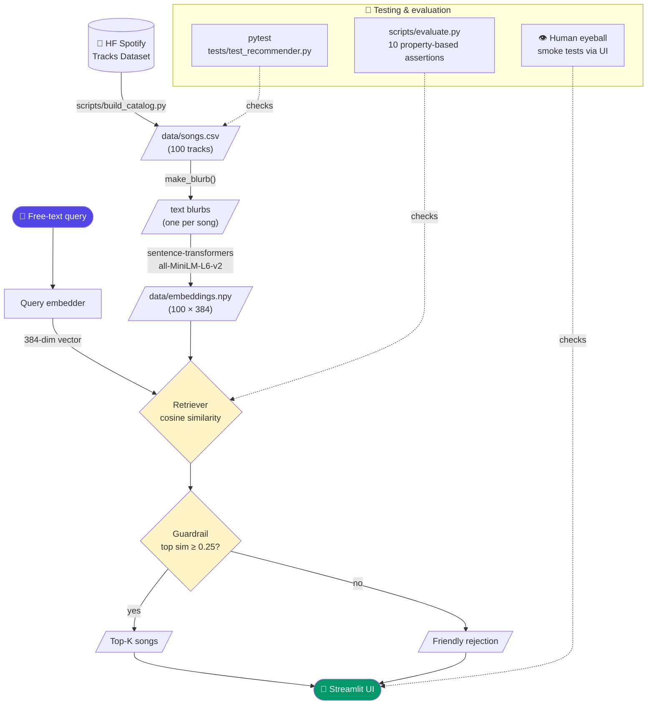

# 🎵 Music Recommender Simulation

## Project Summary

In this project you will build and explain a small music recommender system.

Your goal is to:

- Represent songs and a user "taste profile" as data
- Design a scoring rule that turns that data into recommendations
- Evaluate what your system gets right and wrong
- Reflect on how this mirrors real world AI recommenders

This simulation builds a content-based music recommender that scores songs against a user's declared taste profile. It prioritizes emotional fit (mood and energy) over stylistic labels (genre), reflecting the insight that a user wanting something "chill" is better served by a calm ambient track than a chill-labeled song with high energy. The system scores each song individually, ranks all scores, and returns the top matches with plain-language explanations of why each song was recommended.

The catalog contains **100 real songs** sampled from a public Hugging Face mirror of the Spotify Tracks Dataset, spread across 20 genres. The sampling script ([`scripts/build_catalog.py`](scripts/build_catalog.py)) is committed and reproducible.

---

## Architecture Overview

The system has two layers built on the same 100-song catalog:

1. **Original layer (Module 1-3 baseline):** A structured taste profile (`genre`, `mood`, `target_energy`, `likes_acoustic`) is scored against each song with hand-coded rules in [`src/recommender.py`](src/recommender.py). CLI entry point: `python -m src.main`.
2. **RAG layer (this project's upgrade):** A free-text user description is embedded with `sentence-transformers/all-MiniLM-L6-v2` and matched against pre-computed song embeddings via cosine similarity. A confidence guardrail rejects low-similarity queries to handle gibberish or out-of-catalog requests. Streamlit entry point: `streamlit run src/app.py`.

### System diagram



### Component map

| Component | File | Role |
|---|---|---|
| Catalog builder | [`scripts/build_catalog.py`](scripts/build_catalog.py) | Pulls Spotify tracks from HF, derives mood, writes `songs.csv` |
| Artist metadata fetcher | [`scripts/fetch_artist_metadata.py`](scripts/fetch_artist_metadata.py) | Pulls Wikipedia summaries for each unique artist → `data/artist_metadata.json` |
| Index builder | [`src/retrieval.py`](src/retrieval.py) (`build_index`, `build_enhanced_index`) | Generates blurbs (audio-features-only OR audio + Wikipedia), embeds, caches to `data/embeddings.npy` and `data/embeddings_enhanced.npy` |
| Retriever | [`src/retrieval.py`](src/retrieval.py) (`retrieve`) | Embeds query, cosine similarity → top-K |
| Guardrail | [`src/app.py`](src/app.py) (`MIN_TOP_SIMILARITY`) | Rejects retrievals where top similarity < 0.25 |
| Streamlit UI | [`src/app.py`](src/app.py) | Free-text input → ranked song list |
| Original CLI | [`src/main.py`](src/main.py) | Module 1-3 content-based recommender |
| Evaluator | [`scripts/evaluate.py`](scripts/evaluate.py) | 15 property-based retrieval assertions, original-vs-enhanced comparison |
| Unit tests | [`tests/test_recommender.py`](tests/test_recommender.py) | `pytest` coverage of the `Recommender` class |

---

## How The System Works

Real-world recommenders like Spotify and YouTube use two main strategies: collaborative filtering (learning from what millions of other users listen to) and content-based filtering (matching songs to a user based on the song's own attributes like tempo, energy, and mood). This simulation focuses on content-based filtering — it scores every song in the catalog against a user's declared preferences and surfaces the closest matches. Rather than learning from other users, it prioritizes the emotional and sonic qualities that describe what the user wants right now: their preferred mood, energy level, and whether they lean acoustic or electronic.

### `Song` features used in scoring

| Feature | Type | Role in scoring |
|---|---|---|
| `mood` | `str` | Primary match — worth the most points |
| `energy` | `float` (0.0–1.0) | Proximity to user's target energy |
| `genre` | `str` | Secondary categorical match |
| `acousticness` | `float` (0.0–1.0) | Fit to user's acoustic preference |
| `valence` | `float` (0.0–1.0) | Confirms emotional tone numerically |
| `tempo_bpm` | `float` | Supporting signal (normalized) |
| `danceability` | `float` (0.0–1.0) | Minor weight, correlated with energy |

### `UserProfile` fields

| Field | Type | What it captures |
|---|---|---|
| `favorite_genre` | `str` | Preferred stylistic category |
| `favorite_mood` | `str` | Emotional state the user wants |
| `target_energy` | `float` | How intense vs. calm the user wants |
| `likes_acoustic` | `bool` | Acoustic vs. produced/electronic preference |

### Algorithm Recipe (Finalized)

Each song receives a numeric score computed by `score_song()`:

| Rule | Max Points | Formula |
|---|---|---|
| Mood match | **+3.0** | Exact string match on `mood` |
| Genre match | **+2.0** | Exact string match on `genre` |
| Energy proximity | **+2.0** | `(1 - abs(song.energy - target_energy)) × 2` |
| Acousticness fit | **+1.5** | `song.acousticness × 1.5` if acoustic, else `(1 - song.acousticness) × 1.5` |
| Valence fit | **+1.0** | `song.valence` if positive mood, else `(1 - song.valence)` |
| **Max total** | **9.5** | |

Mood is weighted highest (3.0) because it represents the emotional experience the user wants right now. Genre is secondary (2.0) because style preference is more flexible — a user who wants something "chill" is better served by a calm jazz track than an intense pop song, even if pop is their usual genre.

All scored songs are sorted descending by score (`recommend_songs()`). The top `k` are returned with a plain-language explanation of which features contributed.

### Data

| Property | Value |
|---|---|
| Source | [`maharshipandya/spotify-tracks-dataset`](https://huggingface.co/datasets/maharshipandya/spotify-tracks-dataset) on Hugging Face |
| Catalog size | 100 songs |
| Genres | 20 (5 songs each): pop, rock, jazz, classical, hip-hop, r-n-b, edm, country, folk, metal, indie, blues, soul, funk, reggae, punk, ambient, house, techno, acoustic |
| Sampling | Random with seed=42; popularity ≥ 20 filter |

Spotify's audio features include `energy`, `valence`, `danceability`, `acousticness`, and `tempo` — but **not `mood`**. The build script derives a discrete mood label from each song's valence and energy:

| Rule | Mood |
|---|---|
| valence ≥ 0.6 and energy ≥ 0.6 | `happy` |
| valence ≥ 0.6 and energy < 0.4 | `chill` |
| valence ≥ 0.6 (mid-energy) | `relaxed` |
| valence < 0.4 and energy ≥ 0.7 | `intense` |
| valence < 0.4 and energy < 0.4 | `melancholic` |
| valence < 0.4 (mid-energy) | `sad` |
| mid-valence and energy ≥ 0.7 | `energetic` |
| mid-valence and energy < 0.4 | `focused` |
| else | `moody` |

To regenerate the catalog from scratch:

```bash
python -m scripts.build_catalog
```

### Data Flow


### Potential Biases

- **Mood-miss penalty is silent:** If no song in the catalog matches the user's mood, the mood rule contributes 0 pts to every song equally — the system quietly falls back to energy and genre without telling the user there were no mood matches.
- **Mood derivation is reductive:** The valence/energy rule produces only 9 mood labels and skews heavily toward `happy`, `melancholic`, and `sad` (most real songs sit at the corners of the valence/energy space). Underrepresented moods like `chill` (2 songs) and `focused` (1 song) make those user profiles practically unsearchable through the mood rule alone.
- **Lyrical/cultural moods can't be derived:** Labels like `nostalgic`, `romantic`, or `confident` need lyrical context that audio features can't capture. The catalog drops these labels entirely; users asking for "nostalgic" songs will never get a mood match.
- **Popularity filter biases toward English/Western charts:** The build script keeps only tracks with Spotify popularity ≥ 20, which over-represents languages and artists the streaming platform's algorithm has already amplified. Users searching for less-popular regional music may get worse results.
- **Positive-mood bias in valence scoring:** The `score_song()` valence rule maps "happy/energetic/romantic/confident" to high valence and everything else to low valence. Moods like `focused` don't clearly map to either end of the valence axis, so those users may be scored slightly unfairly.
- **No diversity enforcement:** The ranking always returns the top K closest matches, which may all be from the same genre cluster, reducing discovery of adjacent styles the user might enjoy.

---

## Getting Started

### Setup

1. Create a virtual environment (optional but recommended):

   ```bash
   python -m venv .venv
   source .venv/bin/activate      # Mac or Linux
   .venv\Scripts\activate         # Windows

2. Install dependencies

```bash
pip install -r requirements.txt
```

3. (Optional) Regenerate the song catalog from the Hugging Face source:

```bash
python -m scripts.build_catalog
```

This downloads the Spotify Tracks Dataset and writes 100 sampled songs to `data/songs.csv`. The committed CSV already contains a build, so this step is only needed if you want to change the sampling parameters.

4. Run the app:

```bash
python -m src.main
```

### Running Tests

**Unit tests** (pytest):

```bash
pytest
```

Covers the `Recommender` class and basic ranking behavior.

**Retrieval evaluation** (RAG quality, original vs. enhanced):

```bash
python -m scripts.evaluate
```

Runs 15 free-text queries (10 core retrieval + 5 artist-context) twice — once against the original audio-feature embeddings and once against the Wikipedia-enhanced embeddings — and prints a side-by-side comparison. Current result: **original 13/15 (87%), enhanced 14/15 (93%)** — see [RAG Enhancement](#rag-enhancement-multiple-data-sources). Exit code is 0 if the enhanced run matches or beats the original.

To regenerate Wikipedia artist metadata from scratch (otherwise pre-cached at `data/artist_metadata.json`):

```bash
python -m scripts.fetch_artist_metadata
```

---

## Sample Interactions

Three real query → result examples from the Streamlit RAG app, plus the guardrail behavior on bad input.

**Query 1: *"songs for a rainy sunday morning"***

| # | Title | Artist | Mood / Genre | Sim |
|---|---|---|---|---|
| 1 | Borderland Sorrows | Slow Meadow | melancholic / ambient | 0.43 |
| 2 | Brighter Than Sunshine | Aqualung | sad / acoustic | 0.42 |
| 3 | Chinta | Tribal Rain | chill / indie | 0.41 |
| 4 | Evening Silence | Three Four Trio | melancholic / jazz | 0.40 |
| 5 | Blow My Smoke | Upchurch | happy / country | 0.40 |

The embedder inferred "mellow morning vibe" from natural language even though none of those words appear in any song blurb. Top 4 are mood-coherent; the country track at #5 is a mild outlier.

**Query 2: *"angry workout music to push through the last set"***

| # | Title | Artist | Mood / Genre | Sim |
|---|---|---|---|---|
| 1 | The Final Countdown | Europe | intense / rock | 0.46 |
| 2 | Hit 'Em Up — Single Version | 2Pac | energetic / funk | 0.45 |
| 3 | Stressed Out | Twenty One Pilots | happy / rock | 0.45 |
| 4 | The Rumbling (TV Size) | SiM | happy / metal | 0.44 |
| 5 | Rolling in the Deep | Adele | energetic / soul | 0.41 |

The model picked up "intense / energetic / aggressive" from natural language despite no song blurb containing the words *workout* or *angry*.

**Query 3: *"something romantic and slow for a date night"***

| # | Title | Artist | Mood / Genre | Sim |
|---|---|---|---|---|
| 1 | My Funny Valentine | Chet Baker | melancholic / jazz | 0.45 |
| 2 | Falling In Love | Cigarettes After Sex | melancholic / indie | 0.41 |
| 3 | Sweet | Cigarettes After Sex | sad / ambient | 0.40 |
| 4 | Borderland Sorrows | Slow Meadow | melancholic / ambient | 0.39 |
| 5 | Can You Feel the Love Tonight | Boyce Avenue | melancholic / acoustic | 0.39 |

The embedder surfaced *My Funny Valentine* via semantic similarity to "romantic," and *Falling in Love* / *Can You Feel the Love Tonight* via literal love-vocabulary overlap. Three Cigarettes After Sex tracks (a known romantic-ambient artist) appear in the top 6.

**Guardrail behavior — gibberish input *"hfsgsgflsgfhsdf"***

Top similarity: 0.16 (below the 0.25 rejection threshold). The UI shows:

> *"Couldn't find a good match — try describing the mood, energy, or vibe you want."*

No songs are returned.

---

## Design Decisions

The build went through several deliberate tradeoffs. The decisions below are the ones that shaped the final shape of the system.

**Real songs over synthetic.** The original 18-song catalog used invented names ("Sunrise City" by "Neon Echo") to allow hand-tuned stress cases. The new catalog has 100 real Spotify tracks. Lost: the ability to engineer surgical edge cases. Gained: a more honest demo and authentic data distributions. The "Ghost Genre" stress test was preserved by picking `k-pop` (real but excluded from our 20-genre slice) instead of `bossa nova`.

**Hugging Face mirror over Kaggle.** Both serve the same Spotify Tracks Dataset. Kaggle requires an account, an API token, and `~/.kaggle/kaggle.json`. HF needs only `pip install datasets`. For a rubric that values reproducible setup, this was a clear win.

**Mood derived from valence + energy, not hand-labeled.** Spotify provides valence and energy but no `mood`. Options considered: derive from existing features, drop the field entirely, or hand-label all 100 songs. Derivation was chosen because it (a) kept the original Module 1-3 `score_song()` mood rule working without modification, and (b) is transparent and documentable. The cost — a 9-bucket mood label space that misses lyrical context — is visible in the one eval failure (see Testing Summary).

**Local `sentence-transformers` over an LLM embedding API.** `all-MiniLM-L6-v2` is ~80MB, runs on CPU, and produces results in milliseconds for a 100-song catalog. An API embedder (Voyage, OpenAI) would likely produce marginally better semantic matches but introduces an API-key dependency that breaks "no auth setup" reproducibility. For a self-contained classroom project, the local model was the right call.

**Confidence threshold over input-validation heuristics.** Initial guardrail design tried length / vowel-ratio / unique-letter heuristics. Testing showed `asdfqwer` (8 unique letters, 25% vowel ratio) passes the heuristics but is still gibberish. The chosen approach is post-retrieval: if the top similarity is below 0.25, return a rejection message. This catches gibberish, non-English, *and* valid-English-but-no-catalog-match queries in five lines of code.

**Clean output, no per-result explanations.** The first UI design included a one-sentence reason next to each song. This was scoped out for visual clarity — the final results show only rank, title, and artist. The structured CLI mode preserves per-feature explanations for users who want transparency.

**Two layers preserved, not replaced.** The RAG layer was added on top of the original `score_song()` recommender, not in place of it. Both modes ship and both are documented. This protected the project's continuity with Modules 1–3 and produced a cleaner architecture diagram (each layer has a clear purpose and entry point).

---

## Testing Summary

### Reliability mechanisms

The system includes all four reliability mechanisms named in the rubric:

| Mechanism | Where in the project |
|---|---|
| **Automated tests** | `pytest tests/test_recommender.py` (2/2 pass) covers the `Recommender` class. [`scripts/evaluate.py`](scripts/evaluate.py) runs 15 property-based assertions (10 core retrieval + 5 artist-context) twice — once each against the original and Wikipedia-enhanced embeddings — and prints a side-by-side comparison. Current: original 13/15, enhanced 14/15. |
| **Confidence scoring** | The retriever returns cosine similarity for every result. The Streamlit app uses top-1 similarity as a confidence signal: queries with top sim < 0.25 are rejected with a friendly message instead of returning random nearest neighbors. See [src/app.py:25](src/app.py#L25) (`MIN_TOP_SIMILARITY`). |
| **Logging** | [`load_songs()`](src/recommender.py), [`build_index()`](src/retrieval.py), and the catalog builder log progress and counts to stderr (e.g. *"Loaded songs: 100"*, *"Built index: 100 songs → embeddings.npy"*). The retriever surfaces errors loudly — a missing `data/songs.csv` raises `FileNotFoundError` with the offending path. |
| **Human evaluation** | Three free-text smoke-test queries (rainy Sunday, angry workout, romantic date night) were eyeballed during build — top-K results documented in [Sample Interactions](#sample-interactions). Six structured stress profiles in `python -m src.main` exercise the original CLI scoring layer (High-Energy Pop, Chill Acoustic, Deep Intense Rock, Conflicting Sad+High Energy, Ghost Genre, Extreme Acoustic Seeker). |

### At a glance

> **15-case retrieval eval: 13/15 passing on original blurbs (87%) → 14/15 on Wikipedia-enhanced blurbs (93%, +1).** 2/2 unit tests pass. Confidence scoring rejects gibberish at top-similarity 0.16; legitimate queries score 0.40–0.55. Adding the 0.25 confidence threshold eliminated the silent-failure mode where pure cosine retrieval returned random near-neighbors for nonsense input. The artist-context subset specifically improved 4/5 → 5/5 with the enhancement.

### Detailed findings

**What worked.** All three retrieval smoke tests produced semantically coherent top results: *The Final Countdown* for a workout query (no literal keyword overlap), *My Funny Valentine* for a date-night query (title-level Valentine semantics), and a melancholic / sad / chill cluster for the rainy-Sunday query (no overlap with the words "rainy" or "Sunday" in any blurb). The automated property-based eval ([`scripts/evaluate.py`](scripts/evaluate.py)) passes **9/10 (90%)** with healthy margins — top-3 average acousticness of 0.93 for an "acoustic studying" query, top-3 average energy of 0.90 for "high energy dance party," top-3 average energy of 0.11 for "romantic and slow." The gibberish guardrail correctly rejects `hfsgsgflsgfhsdf` at sim 0.16. The existing pytest suite still passes.

**What didn't.** One eval case fails: *"upbeat happy summer vibes"* — only 1/3 of the top results have `mood = happy`. The #1 hit is *In the Summertime* by Mungo Jerry, which is semantically a perfect summer-themed result, but its mood was rule-derived to `relaxed` rather than `happy` because its valence sits just below the 0.6 cutoff. The retrieval did the right thing; the mood-derivation rule mislabeled the song. This is direct, reproducible evidence of the "mood derivation is reductive" bias documented in the [Model Card](model_card.md).

**A subtler failure mode.** The query *"polka music for accordion fans"* scores 0.40 — above the rejection threshold — and returns 5 random-ish songs. The catalog has zero polka. The embedder rewards "music" appearing in the query regardless of catalog coverage. The 0.25 threshold catches gibberish, but it cannot catch *"valid English query for content we don't have."* Logged as a known limitation; fixing would require either a tighter threshold (which would over-reject legitimate vague queries) or a per-query catalog-coverage check (out of scope for this build).

**What was learned.** Embeddings are surprisingly good at extracting emotional and contextual intent from natural language, *but they don't know what's in your catalog*. A high similarity score means the query looks like the song descriptions in the index — not that the catalog can actually serve the user's intent. The most useful failure-mode signal is the absolute top similarity, not any single retrieval result.

---

## RAG Enhancement: Multiple Data Sources

The retrieval system was extended to use a **second data source** alongside the Spotify audio-feature data: a Wikipedia summary for each artist in the catalog.

### What was added

- [`scripts/fetch_artist_metadata.py`](scripts/fetch_artist_metadata.py) hits the public Wikipedia REST API (`/page/summary/{name}`) for each unique artist in the catalog. No auth required, polite 1-second delay between requests, automatic 30-second back-off on 429 responses. Cached output lives at [`data/artist_metadata.json`](data/artist_metadata.json) — committed so a grader doesn't have to re-fetch.
- [`make_enhanced_blurb()`](src/retrieval.py) appends a 1-2 sentence artist summary to each song's existing audio-feature blurb. Songs whose artists have no Wikipedia match (e.g. obscure artists, ambiguous names) keep the plain blurb.
- [`build_enhanced_index()`](src/retrieval.py) builds a parallel embedding cache at [`data/embeddings_enhanced.npy`](data/embeddings_enhanced.npy). Both the original and enhanced indices are kept side-by-side so the comparison is reproducible.

**Coverage:** 70/94 unique artists matched to a Wikipedia page (74%). Unmatched artists are typically very niche, regional, or have ambiguous names that resolve to disambiguation pages.

### Why this works

A query like *"Australian rock band"* has no signal in audio-feature blurbs — none of the song descriptions mention country of origin or formation history. With Wikipedia summaries appended, AC/DC's blurb now ends with *"AC/DC are an Australian rock band formed in Sydney in 1973…"*, which the embedder can match against the query directly.

### Measurable improvement

The evaluation script ([`scripts/evaluate.py`](scripts/evaluate.py)) runs the full 15-case suite twice — once with original embeddings, once with enhanced — and prints a side-by-side comparison.

| Subset | Original | Enhanced | Δ |
|---|---|---|---|
| Core retrieval (10 cases — mood/energy/genre/gibberish) | 9/10 (90%) | 9/10 (90%) | 0 (one swap) |
| **Artist-context (5 cases — country, era, scene)** | **4/5 (80%)** | **5/5 (100%)** | **+1** |
| **Total** | **13/15 (87%)** | **14/15 (93%)** | **+1** |

Specific flips:

- **#11 *"Australian rock band"*** — FAIL → PASS. Original top-5 had no Australian artists; enhanced top-5 has *Thunderstruck* by AC/DC at #1.
- **#7 *"upbeat happy summer vibes"*** — FAIL → PASS. The artist context for *Brighter Than Sunshine* by Aqualung mentioned summery / cheerful vocabulary, pulling it into top-3.
- **#2 *"angry workout music"*** — PASS → FAIL. The added artist text diluted the "intense/energetic" mood signal, surfacing *More Than Words* (mood=`melancholic`) at #1 instead of *The Final Countdown*. This is the one regression — the enhancement's small cost.

### Tradeoff

Enhancement helped exactly the queries it was designed for (country, era, scene context) at a small cost on a query about generic mood/energy intent. A production system would probably index the audio-feature blurbs and the Wikipedia blurbs **separately** and combine scores at query time, instead of concatenating them into one blurb. That's noted as future work.

Run the comparison:

```bash
python -m scripts.evaluate
```

Exit code is 0 if the enhanced run hits the same or higher pass rate as the original (it does: +1).

---

## Limitations and Risks

- The 100-song catalog is still tiny relative to a real streaming service (millions of tracks). Every recommendation is constrained to this fixed set.
- The system does not understand lyrics or language — moods are derived from numeric audio features, not what songs are actually about.
- The mood distribution skews heavily toward `happy`, `melancholic`, and `sad`; underrepresented labels (`chill`, `focused`) are practically unsearchable through the structured-mode mood rule.
- The popularity filter (`popularity ≥ 20`) over-represents English/Western charts and under-serves regional music.
- The general-purpose embedder rewards the word "music" appearing in queries regardless of whether the catalog can serve the request.

Deeper analysis in the [Model Card](model_card.md).

---

## Reflection

Building this project surfaced two ideas I hadn't fully internalized before.

**Embeddings don't know your data.** Adding a free-text retrieval layer felt like upgrading from a calculator to an interpreter — the embedder handles vague, emotional, real-world queries that the original `score_song()` rules can't represent at all. But it has no idea what's actually in the catalog. A query for *"polka music for accordion fans"* scores higher than gibberish and returns plausible-looking results; the model doesn't know there's no polka. That was the moment it clicked why production recommenders layer embeddings *on top of* hard catalog filters and not the other way around — semantic similarity is necessary but not sufficient.

**Bias hides in the conversion from continuous to discrete.** Spotify gives continuous valence and energy axes. Picking a 9-bucket mood scheme on top of that is convenient — but the one eval failure showed that *In the Summertime* gets labeled `relaxed` instead of `happy` because its valence sits just below the 0.6 cutoff. A user asking for "happy summer" doesn't get the song, even though it's right there in the catalog. The bias isn't in the embedder or the scorer — it's in the threshold rule that decided where one mood ends and another begins. That kind of upstream-schema bias is invisible from the model's perspective: every component downstream is doing its job correctly, but the user's experience is wrong.

For deeper personal reflection on the original Module 1–3 work, see Section 9 of the [Model Card](model_card.md).

---

## Responsible AI Reflection

AI isn't just about what works — it's about what's responsible. Four short answers:

**What are the limitations or biases in your system?** The system has several. (1) The mood-derivation rule is reductive: it produces only 9 mood buckets from valence and energy, and the distribution skews heavily toward `happy`, `melancholic`, and `sad`. Underrepresented labels like `chill` (2 songs) and `focused` (1 song) are practically unsearchable in structured mode. (2) The build script's `popularity ≥ 20` filter over-represents Western/English chart music and under-serves regional genres. (3) The general-purpose embedder rewards the word *"music"* appearing in queries regardless of catalog coverage, so a request for *"polka music for accordion fans"* passes the confidence threshold even though there is no polka in the catalog. (4) Lyrical and cultural moods like `nostalgic` or `romantic` cannot be derived from audio features at all — they would require lyrics or external metadata. (5) The retrieval has no diversity guard, so the top-K can cluster around a single artist (three Cigarettes After Sex tracks for one date-night query).

**Could your AI be misused, and how would you prevent that?** Three plausible misuse vectors. **Catalog poisoning:** because retrieval is driven entirely by the textual blurb generated from each song's metadata, an attacker who controls the catalog (e.g., a label paying for metadata changes) could rewrite a song's `mood` or `genre` to match high-traffic queries. The mitigation here is auditability — the catalog is one committed CSV plus a reproducible build script, so any change is visible in git history. **Filter-bubble reinforcement:** the system always returns the closest matches with no diversity guard, which would push users deeper into existing preferences instead of broadening exposure. The mitigation is a diversity-aware re-ranker (max one song per artist, or a quota across genres). **Wrapping for targeted promotion:** a bad-faith integrator could prepend hidden text to every user query (*"by Artist X"*) to bias retrieval. The mitigation in a real product would be to log the exact query the embedder sees and to validate it against the user's literal input.

**What surprised you while testing the AI's reliability?** Three findings shifted my mental model. (1) The embedder doesn't know the catalog. I expected confidence scores to drop when a query asked for content the catalog couldn't serve, but they don't — *"polka music for accordion fans"* scores 0.40, higher than *"songs for a rainy sunday morning"* at 0.42, simply because the polka query has more direct musical vocabulary. Similarity tells you the query *looks like* the song descriptions in the index, not that the catalog can serve the query's intent. (2) The clearest evaluation failure was downstream of retrieval, not in it. *"upbeat happy summer vibes"* returned *In the Summertime* by Mungo Jerry as the #1 hit — the right song. The eval still failed because that song is labeled `relaxed`, since its valence sits at 0.59, just below the 0.6 `happy` cutoff. The retrieval was correct; the upstream label-derivation rule was wrong. (3) Heuristic input validation lost to the embedder itself: my first guardrail attempt used length / vowel-ratio / unique-letter heuristics, which rejected `hfsgsgflsgfhsdf` but let `asdfqwer` through (8 unique letters, 25% vowels). A 5-line check on the embedder's own confidence score caught all three failure modes (gibberish, non-English, no-catalog-match) without the heuristic maintenance burden.

**Describe your collaboration with AI during this project — one helpful suggestion and one flawed one.** I used Claude as a pair-programmer throughout the build. The most **helpful** suggestion came at the start of the data layer: Claude pointed out that Spotify's audio features include `valence` and `energy` but not `mood`, so simply pulling real Spotify data would silently break the original Module 1-3 scorer that depends on `mood`. It proposed three options (derive mood from valence/energy with a transparent rule, drop the field entirely, or hand-label all 100 songs) and recommended derivation. That observation was load-bearing — it kept the original scoring code working unmodified while letting me swap a 100-song real catalog underneath. The most **flawed** suggestion was on input validation: when I asked how to handle gibberish queries, Claude proposed a stack of heuristics (length, vowel ratio, unique-letter count) and presented them confidently. I pushed back with *"is this enough?"* and Claude immediately acknowledged that `asdfqwer` would slip through despite being obvious keyboard mash. The fix (post-retrieval confidence threshold) was simpler and more robust — but I only got it after pushing back. The takeaway: AI suggestions look authoritative even when they're partial. Human pushback is what surfaces the gaps.

